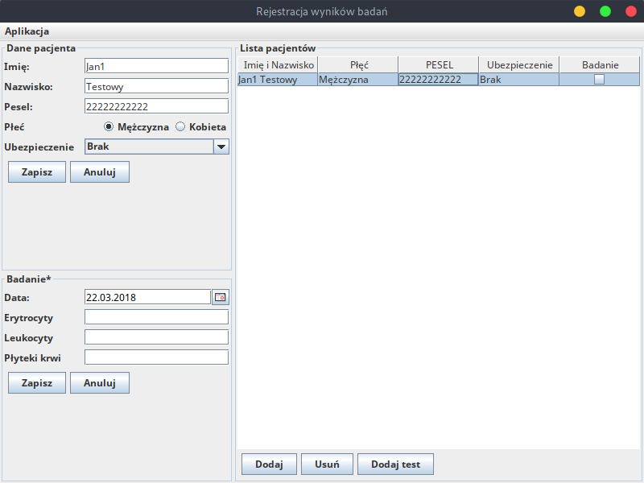

# OSM Projekt 1

Pierwszy projekt na **O**programowanie **S**ystemów **M**edycznych

## Podgląd

## Autorzy

Adam Jędrzejowski <adam@jedrzejowski.pl> 277417

Adam Cisak <a.cisak@stud.elka.pw.edu.pl> 277396

## Linecja

Ten projekt jest linencjonowyany pod licencją WTFPL, tekst licencji dostępny w pliku `LICENCE.md`